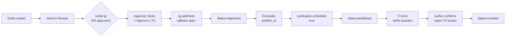
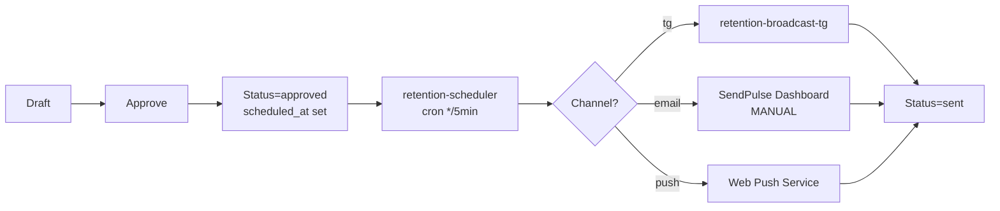
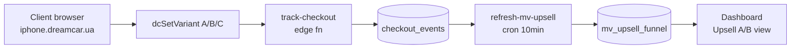

# DreamCar Team Hub — Architecture

Архітектурна карта production системи. Документ розрахований на нового developer / технічного партнера, що має повний access до інфраструктури.

Останнє оновлення: **07.06.2026**. Project Supabase: `wotghlaehnvxyeacznvv`.

---

## 1. High-level architecture

```
┌─────────────────────────────────────────────────────────────────┐
│                          USERS / TEAM                            │
│   Team members (browser)   ←→   Telegram (@dreamcar_team_bot)    │
└──────────────────┬───────────────────────┬──────────────────────┘
                   │                       │
        ┌──────────▼──────────┐   ┌────────▼────────┐
        │  Cloudflare CDN     │   │  TG webhook     │
        │  (Pages + DNS)      │   │  → tg-webhook   │
        └──────────┬──────────┘   └────────┬────────┘
                   │                       │
        ┌──────────▼───────────────────────▼──────────┐
        │   FRONTENDS (GitHub Pages, Vanilla JS SPA)  │
        │   team.dreamcar.ua → dreamcar-team repo     │
        │   dashboard.dreamcar.ua → dreamcar-dashboard│
        │   brand.dreamcar.ua → brand-book            │
        └──────────────────────┬──────────────────────┘
                               │  HTTPS / RLS-protected
                  ┌────────────▼────────────┐
                  │   SUPABASE (eu-central) │
                  │   - Postgres 17          │
                  │   - 28 Edge Functions    │
                  │   - 32+ pg_cron jobs     │
                  │   - Storage / Realtime   │
                  └──────┬──────────┬────────┘
                         │          │
        ┌────────────────▼──┐   ┌───▼─────────────────┐
        │   External APIs   │   │   External targets  │
        │   - Meta Graph    │   │   - Telegram Bot API│
        │   - SendPulse     │   │   - Cloudflare R2    │
        │   - Anthropic     │   │   - OpenAI Whisper   │
        └───────────────────┘   └─────────────────────┘
```

---

## 2. Repos map

| Repo | URL | Призначення |
|------|-----|-------------|
| `dreamcarua/dreamcar-team` | team.dreamcar.ua | Основний hub: SMM, Tasks, Retention, Projects, Onboarding |
| `dreamcarua/dreamcar-dashboard` | dashboard.dreamcar.ua | Live аналітика — продажі, upsell A/B, ROI, FB Ads ETL |
| `dreamcarua/brand-book` | brand.dreamcar.ua | Бренд: лого, кольори, шрифти, global-header.js |
| `dreamcarua/dreamcar-supabase` | — | Edge functions source code, SQL migrations, deploy via GH Actions |
| `dreamcarua/dreamcar-team` (cowork-notify/) | — | TG bot bridge: JSON commits → DM Вадиму |

---

## 3. Frontends overview

### 3.1 SMM (`/hq/`) → team.dreamcar.ua/hq/

**Призначення:** управління контентом для Instagram / TG каналів. Workflow: drafting → review → DM stakeholders → approve → schedule → publish → verify.

**Views:**
- List (default) — таблиця публікацій з фільтрами
- Calendar — Місяць/Тиждень/День
- Board (Kanban) — статуси як колонки
- Trash — soft-delete bin (30 днів)

**Ключові файли:**
- `hq/index.html` — entry, sidebar, login gate
- `hq/app.js` — Store, CRUD, views, approval flow
- `hq/app-onboarding.js` — interactive guided tour
- `hq/calendar.js` — календарний рендерер

**Таблиці БД:** `publications`, `publication_attachments`, `publication_comments`

### 3.2 Retention (`/retention/`) → team.dreamcar.ua/retention/

**Призначення:** управління розсилками: Email, Telegram, Push, SMS, Viber, Other. Workflow: draft → approval → scheduled cron → sent.

**Views:** List, Calendar (Month/Week/Day), Board.

**Канали:** 6 типів. Статусів: 9 (draft, pending_review, approved, scheduled, sending, sent, failed, cancelled, archived).

**Ключові файли:**
- `retention/index.html`, `retention/app-retention.js`
- Edge fn `retention-scheduler` (cron every 5min)

**Таблиці БД:** `retention_messages`, `retention_attachments`, `retention_comments`, `retention_recipients`

### 3.3 Tasks (`/tasks/`) → team.dreamcar.ua/tasks/

**Призначення:** team tasks tracker — Inbox / Doing / Review / Done. Soft-delete з корзиною на 30 днів.

**Views:** List, Calendar (по дедлайнах), Board, Trash.

**Ключові файли:**
- `tasks/index.html`, `tasks/app.js`, `tasks/app-onboarding.js`

**Таблиці БД:** `team_tasks`, `team_task_comments`, `team_task_watchers`, `team_task_notifications`

### 3.4 Projects (`/projects/`) → team.dreamcar.ua/projects/

**Призначення:** Запуски (launches) — окрема система після винесення з SMM (Phase 2).

**Ключові файли:**
- `projects/index.html`, `projects/app-projects.js`

**Таблиці БД:** `launches`, `launch_phases`, `launch_milestones`

### 3.5 Dashboard → dashboard.dreamcar.ua

**Призначення:** live аналітика — продажі по проекту, upsell A/B/C funnel, ROI, FB Ads ETL.

**Sections:** Overview, Active Launch, Upsell A/B, ROI per project, Today/Week/Month.

**Repo:** `dreamcarua/dreamcar-dashboard` (окремий, тільки read-only до Supabase через SSO bridge з HQ).

**Таблиці БД:** `dashboard_deals`, `dashboard_ads_data`, `checkout_events`, materialized view `mv_upsell_funnel`.

### 3.6 Brand → brand.dreamcar.ua

**Repo:** `dreamcarua/brand-book`. Static. Видає `global-header.js` що інжектиться у `<head>` КОЖНОЇ HTML сторінки решти проектів.

### 3.7 Onboarding (`/onboarding/`) → team.dreamcar.ua/onboarding/

Документація для нової людини у команді: hq, tasks, dashboard, brand-book, secrets, GDPR, CRON, audit.

---

## 4. Database schema (ключові таблиці)

Postgres 17 на Supabase. RLS включений на ВСІХ таблицях що містять PII або бізнес-дані. Connection: `aws-0-eu-central-1.pooler.supabase.com` (pgBouncer).

### `users` — команда
| Колонка | Тип | Опис |
|---|---|---|
| `id` | uuid PK | внутрішній ID (НЕ auth.uid()) |
| `auth_id` | uuid | зв'язок з `auth.users.id` |
| `email` | text | login email |
| `name`, `display_name` | text | імʼя у UI |
| `role` | user_role enum | `ceo` / `coo` / `lead` / `member` / `designer` (НЕ `admin`!) |
| `telegram_id` | bigint | для DM від `@dreamcar_team_bot` |
| `telegram_username` | text | auto-discovery з повідомлень |
| `desk_id` | uuid FK | до `desks` |

Helper: `current_user_id()` → перетворює `auth.uid()` у `users.id` через `auth_id`.

### `desks` — столи (команди)
SMM-стіл, Retention-стіл, Operations-стіл і т.д. Десятки команд групуються по desk_id.

### `publications` — SMM (`/hq/`)
| Колонка | Опис |
|---|---|
| `id` uuid PK | |
| `title`, `body` text | контент |
| `status` text | draft / pending_review / approved / scheduled / published / verified / rejected / cancelled / deleted |
| `channels` text[] | instagram, tg_channel_*, etc. |
| `publish_at` timestamptz | scheduled time (CET) |
| `published_at` | факт публікації |
| `approver_ids` uuid[] | кого треба DM-ити |
| `assignee_id` uuid | відповідальний |
| `desk_id` uuid | стіл |
| `deleted_at` timestamptz | soft-delete (30d retention) |

Related: `publication_attachments`, `publication_comments`.

### `retention_messages` — Retention (`/retention/`)
Аналогічна `publications` структура, але `channel` enum: `email`, `tg`, `push`, `sms`, `viber`, `other`.

### `team_tasks` — Tasks (`/tasks/`)
| Колонка | Опис |
|---|---|
| `id` uuid PK | |
| `title`, `description` text | |
| `status` text | inbox / doing / review / done / deleted |
| `assignee_id`, `creator_id` uuid | |
| `due_at` timestamptz | дедлайн |
| `project_id` uuid FK | до `launches` |
| `priority` text | low/medium/high |
| `parent_task_id` uuid | для subtasks |
| `deleted_at` | soft-delete |

Related: `team_task_comments`, `team_task_watchers`, `team_task_notifications`.

### `launches` — Projects (`/projects/`)
Запуски DreamCar (Проєкт #16 BMW X5, Проєкт #17, iPhone і т.д.). Колонки: `code` (X5, IP15, …), `title`, `prize`, `phase` (planning / live / closing / done), `starts_at`, `ends_at`.

### `dashboard_deals` — продажі (Dashboard)
Транзакції з CRM. Колонки: `deal_id`, `project_code`, `amount_uah`, `paid_at`, `customer_email_hash` (PII-safe).

### `checkout_events` — upsell A/B tracker
Anon endpoint events. Колонки: `event_id`, `session_id`, `variant` (A/B/C), `step` (view/click/start/success), `created_at`.

### `dashboard_ads_data` — FB Ads ETL
GH Action cron */15 пушить з 3 ad accounts (UAH, CLUB USD, CLUB UAH).

---

## 5. Edge functions inventory (28 шт.)

Усі — Deno + TypeScript, deploy через GH Action `deploy-edge-fns.yml` після push у `dreamcarua/dreamcar-supabase/functions/`. Детальний API — у [API.md](API.md).

**Notifications & Messaging:**
- `notify-tg` — universal DM/group notifier (publications, tasks, retention)
- `tg-webhook` — TG bot handler (commands, callbacks, mentions)
- `cron-reminders` — T-10 / T+10 nags для approachers

**Publications / SMM:**
- `verify-publication` — IG→TG mirror через Make.com (current)
- `verify-publication-ig` — DEPRECATED (IG Graph API)
- `publication-scheduler` — auto-status transition scheduled→published

**Retention:**
- `retention-scheduler` — cron 5min, sends approved messages
- `retention-broadcast-tg` — TG channel broadcast helper

**Tasks / AI:**
- `tg-task-extract` — emoji-trigger Claude Haiku → задача з повідомлення
- `tg-daily-task-scan` — cron 09:00 KY scan для batch task proposals
- `task-notification-enqueue` — DB trigger → notify_tg

**Tracker / Analytics:**
- `track-checkout` — anon endpoint, upsell A/B/C events
- `refresh-mv-upsell` — periodic materialized view refresh
- `dashboard-roi-recalc` — ROI per project agg

**Auth / SSO:**
- `sso-bridge` — передача access_token між HQ ↔ Tasks ↔ Dashboard через URL fragment
- `tg-oauth-callback` — TG login widget callback

**Integrations:**
- `sendpulse-readonly-proxy` — READ-ONLY проксі до SendPulse API
- `meta-ads-pull` — manual run для FB Ads ETL (cron у dreamcar-dashboard)
- `whisper-transcribe` — OpenAI Whisper для voice notes у TG

**Admin / Ops:**
- `cleanup-soft-deleted` — cron daily, hard-delete після 30d
- `audit-log-append` — централізований audit log
- `dispatch-workflow` — event-driven trigger для GH Actions (compress, etc.)

**Internal:**
- `health`, `me`, `whoami`, `user-search`, `bind-tg`, `unbind-tg`, `attach-upload`

> Точний реєстр з кодом: див. `dreamcarua/dreamcar-supabase/functions/` + `mcp__supabase__list_edge_functions`.

---

## 6. Cron jobs

32+ pg_cron + GH Action cron jobs. Реєстр з частотою, owner, SQL/payload — у [CRON_JOBS.md](CRON_JOBS.md).

Ключові:
- `retention-scheduler` — */5 * * * * (every 5min)
- `cron-reminders` — * * * * * (every minute, T-10/T+10 window)
- `tg-daily-task-scan` — 0 7 * * * UTC (= 09:00 Kyiv summer / 10:00 winter)
- `cleanup-soft-deleted` — 0 3 * * * (3 AM daily)
- `refresh-mv-upsell` — */10 * * * *
- FB Ads ETL — */15 (GH Action у dreamcar-dashboard)

---

## 7. Data flow diagrams

### 7.1 SMM publication flow



Канал DM-у: `@dreamcar_team_bot` → особисто approver_ids (CEO/COO/lead). Якщо у групі — reply у group thread `-1003933841573` (test) / `-1002496656144` (prod, поки не використовуємо).

### 7.2 Retention flow



> Email НЕ через API SendPulse — SendPulse READ-ONLY (HARD RULE з SECRETS.md).

### 7.3 Upsell A/B tracker flow



### 7.4 TG bot flow

```mermaid
flowchart LR
    A[User у TG] --> B[Webhook → tg-webhook]
    B --> C{Type?}
    C -->|/command| D[Commands handler<br/>/start /tasks /listen_here /me]
    C -->|callback| E[Callback handler<br/>appr: rmappr: vrfy: task: taskprop: qappr: attach:]
    C -->|message + emoji 📌| F[tg-task-extract<br/>Claude Haiku]
    C -->|@mention| G[resolveAssignee]
    C -->|buffer| H[tg-daily-task-scan<br/>09:00 cron]
```

---

## 8. External integrations

| Integration | Призначення | Credential | Mode |
|---|---|---|---|
| **Telegram Bot API** | `@dreamcar_team_bot` — DM, групи, callbacks | `TG_BOT_TOKEN` env | RW |
| **Meta Graph (FB)** | FB Ads ETL (3 accounts), Page insights | System User `Volvo_Dashboard_API` (61584044034889) | Read |
| **SendPulse** | CRM база (~40k contacts), email | `X-SP-ID` / `X-SP-SECRET` | 🔴 READ-ONLY |
| **Anthropic Claude** | tg-task-extract, tg-daily-task-scan (Haiku) | `ANTHROPIC_API_KEY` | API |
| **OpenAI Whisper** | Voice notes → text | `OPENAI_API_KEY` | API |
| **Cloudflare R2** | Storage для attachments (publications, retention) | R2 credentials | RW |
| **GitHub Actions** | Deploy, ETL, compress | `GITHUB_TOKEN` репо-scoped | RW |
| **Make.com** | IG→TG mirror (verify-publication) | Make webhook URL | Webhook |

Деталі — у [SECRETS.md](SECRETS.md).

---

## 9. Materialized views

Materialized views для важких аналітичних запитів. Refresh — через cron, окремий edge fn.

| View | Source | Refresh | Призначення |
|---|---|---|---|
| `mv_upsell_funnel` | `checkout_events` | */10min via `refresh-mv-upsell` | Dashboard Upsell A/B/C funnel |
| `mv_roi_per_project` | `dashboard_deals` + `dashboard_ads_data` | hourly | ROI per project (Проєкт #16 BMW, etc.) |
| `mv_team_workload` | `team_tasks` group by assignee | every 5min | Tasks завантаженість команди |
| `mv_publication_stats` | `publications` agg | nightly | SMM KPI |

Refresh обовʼязково `CONCURRENTLY` щоб не блокувати read.

---

## 10. Security model

### 10.1 Closed system auth

**🔴 Юзерів створює тільки CEO/COO через `/hq/`. Публічної реєстрації НЕМАЄ.** Тому:
- Не пропонувати rate-limit на signup
- Не пропонувати HIBP password check
- Не пропонувати CAPTCHA

### 10.2 Login flows

1. **Email + Magic Link** (Supabase Auth) — default
2. **TG OAuth** (`tg-oauth-callback`) — через Login Widget
3. **SSO bridge** — HQ → Tasks / Dashboard через URL fragment `#access_token=…` + cookie-based shared storage

### 10.3 RLS

ВСІ таблиці з PII / бізнес-даними мають RLS. Policy базується на `current_user_id()` + `user_role`:
- `ceo`, `coo` — read/write усе
- `lead` — read/write своя desk + read інші desks
- `member` — read/write свої записи + read desk-mate
- `designer` — обмежений до своїх attachments

При додаванні нової таблиці: ОБОВ'ЯЗКОВО включити RLS і написати policy.

### 10.4 Service-role usage

Edge functions використовують `SUPABASE_SERVICE_ROLE_KEY` тільки коли треба обійти RLS (cron, notifications). Frontend — тільки `anon` key.

### 10.5 Secrets

Усі secrets — у GH Actions secrets + Supabase Vault. Ніяких hardcoded токенів. Rotation policy: 90 днів. Деталі у [SECRETS.md](SECRETS.md).

---

## 11. Deployment

### 11.1 Frontends (GitHub Pages + Cloudflare)

```
git push origin main
  ↓
GitHub Pages auto-publish (1-2min)
  ↓
Cloudflare CDN cache (PURGE on deploy via _headers)
  ↓
team.dreamcar.ua live
```

CNAME файл у root репо вказує домен.

### 11.2 Edge functions (Supabase)

```
git push origin main → dreamcarua/dreamcar-supabase
  ↓
GH Action deploy-edge-fns.yml
  ↓
supabase functions deploy <fn> --no-verify-jwt? (per fn)
  ↓
Live на https://wotghlaehnvxyeacznvv.supabase.co/functions/v1/<fn>
```

### 11.3 SQL migrations

```
SQL у dreamcar-supabase/migrations/<timestamp>__<name>.sql
  ↓
git push → GH Action runs supabase db push
  ↓
Migration applied + version tracked
```

🔴 Перед UPDATE/INSERT з конкретними колонками — grep migrations щоб не зловити `undefined_column` (HARD RULE).

### 11.4 Rollback

Деталі — у [ROLLBACK.md](ROLLBACK.md). Quick: `git revert <commit> && git push` для frontends. Для DB — окрема down-migration.

---

## 12. Domains / DNS

| Domain | Type | Target |
|---|---|---|
| `team.dreamcar.ua` | CNAME | `dreamcarua.github.io` |
| `dashboard.dreamcar.ua` | CNAME | `dreamcarua.github.io` |
| `brand.dreamcar.ua` | CNAME | `dreamcarua.github.io` |
| `iphone.dreamcar.ua` | CNAME | landing на CF Pages |
| `*.supabase.co` | — | managed by Supabase |

DNS — у Cloudflare. SSL — full strict.
